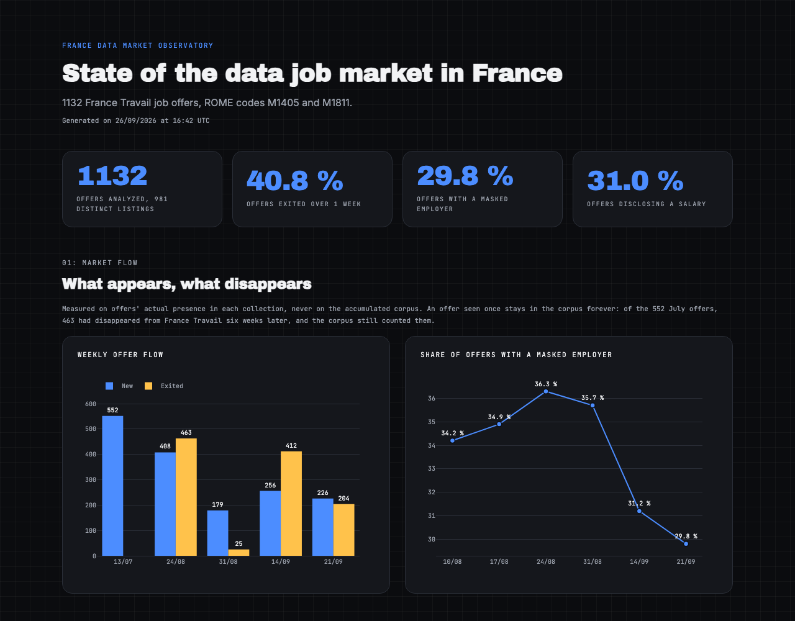

# France Data Market

A dbt + DuckDB pipeline that collects French data-job postings from the France Travail API every week, enriches them with company data (SIRENE) and a local-LLM skill extraction, and publishes a market report.

**Every non-trivial choice below is backed by a measurement on real data, not a guess.**

**[→ Open the live report](https://ricksan37.github.io/france_data_market/)** (regenerated every Monday by GitHub Actions)

[](https://ricksan37.github.io/france_data_market/)

## What the market says

Measured on 981 distinct listings (1,132 offers) collected between July and September 2026, data analyst, data scientist and data engineer roles (ROME codes M1405 and M1811).

1. ~~**Offers are short-lived.** Of the 552 offers live in mid-July, 463 (84%) had disappeared from France Travail six weeks later.~~ **Invalid, withdrawn on 2026-09-26.** Every pull up to then was truncated by a pagination bug: the API ignored the range the code sent and served the same first page, so the two largest categories (ROME M1811 and "data analyst", 427 and 221 offers on 2026-09-26) were capped at their first 150 offers. An offer that slid out of that first page counted as "disappeared" while still online, so the 84% mixes real exits with truncation and can't be separated after the fact. It will be re-measured on pulls made with the fixed pagination.
2. **Salaries are rarely shown, and almost never when the employer is hidden.** 31% of listings disclose a salary: 55% for recruitment intermediaries, 38% for direct employers, 9% when the employer's name is masked (about 3 offers in 10).
3. **Where a salary is shown, it sits in a narrow band.** The median annual salary is €42.5k–45k whatever the employer type. Required experience is what moves it: €45k when experience is required (n=208) vs €38.5k when beginners are accepted (n=50).

Built as a hands-on Analytics Engineering project on a real, messy public dataset. The rest of this page is for technical readers.

---

## A few decisions that show the approach

**Company matching went from 19.2% to 80.3%.** The first attempt (name + postal code) matched one offer in five. Eleven diagnostic rounds later — each triggered by a measurement on real data — the rate reached 80.3% on the 213 eligible offers. Two rules that *worked* were later removed because they produced false positives: the rate gained more in reliability than in volume.

**The geographic key wasn't what I assumed, and I only half-fixed it.** The original plan used postal code to join company data. Measured: postal code covers 166 of 213 target offers, INSEE commune code covers 198 — a strict superset. I fixed the company enrichment, but not the geography dimension, which stayed indexed on postal code alone. Paris, Lyon and Marseille are the three French communes with arrondissements: they have no single postal code, so the source returns their overall INSEE code instead, with an empty postal code. Measured: 95 offers affected, 77 of them in Paris — the report was showing 74 Parisian offers instead of 151. A unified key (`coalesce(postal_code, commune_code)`) took coverage from 79% to 89%. The lesson wasn't "fix this one join," it was "this source's geographic key isn't the postal code" — and I'd only applied it locally the first time.

**Three local LLMs, compared blind on a real task.** To extract technical skills from free-text listings, three models ran locally (Ollama) on the same prompt and reference offer: Mistral 7B, Qwen3 8B and Mistral-Nemo 12B. Speed and quality didn't scale simply with size: Qwen3 in "thinking" mode took 258s/offer for a marginal quality gain; turning that off made it 23x faster with no quality loss. Only Nemo reliably told a named product (Azure, Databricks) apart from a technical concept (RAG, CI/CD) — a gap three prompt rewrites couldn't close on the smaller models. The model was picked on that measurement, not its reputation.

**My own fact table was measuring the wrong thing.** `fct_job_offer` unions every collected dump and deduplicates: correct for a corpus, wrong for a market reading — an offer seen once stays in it forever. Measured: of the 552 July offers, 463 had disappeared from France Travail six weeks later, and the corpus still counted them. So there are two fact tables instead of one: `fct_weekly_market` measures the accumulated corpus, `fct_weekly_market_flow` measures actual presence in each pull and is the only one that can say what appears and disappears. The test that keeps it honest ties three independently computed measurements together: a week's active offers must equal the previous week's, minus exits, plus new ones (`552 - 463 + 408 = 497`). The design holds; the figures don't — they were measured on truncated pulls (see the history break below), so the 463 exits are not a market measurement.

**Invisible on the aggregate, destructive on a slice.** Fifteen offers out of 275 carry an implausible annual salary — eleven at 1,800€, four between 15 and 40€/hour mislabeled as annual. On the overall median they change nothing (45,000€ either way). On a slice, they invert it: offers mentioning Tableau showed a median of 1,800€ instead of 37,000€. All eleven 1,800€ offers were also classified `ANONYMOUS`, creating a fake 5,000€ gap against `DIRECT_EMPLOYER` — once excluded, all categories land on the same 45,000€. A flag (`annual_salary_plausible`), not a silent reclassification, excludes them without destroying the value.

**Counting offers vs. counting listings.** Deduplication catches the API's own index duplicates, not marketing campaigns: the same position posted in several cities gets one identifier per city. Measured: 152 offers out of 960 (15.8%) share their exact text with another. Once campaigns are neutralized, two rankings flip: Python (262) overtakes SQL (235), and Data Analysis overtakes Data Governance. Nothing is deleted — a `cluster_size` / `is_canonical_listing` pair exposes the choice, and every report metric states which one it counts.

---

## Repository layout

The eight Python scripts at the root are the pipeline's standalone stages (ingestion, enrichment, extraction, snapshots). The 23 scripts in `exploration/` are diagnostic scripts, kept for traceability: each one produced a measurement cited on this page (matching rates, deduplication, geographic key, salary plausibility), so every figure can be re-derived.

## Architecture

```
France Travail API ──► full_pull.py ──► data/raw/job_offers_*.json ─┐
                                                                         │
DINUM API ──► enrich_dinum.py ──► data/raw/enrich_dinum_*.json ────────┤
                                                                         │
Local LLM (Ollama) ──► extract_skills.py ──► data/raw/extract_skills_*.json ┤
                                                                         ▼
                                                                  dbt sources
                                                                         │
                                                                    staging
                                                                         │
                                                                  intermediate
                                                                         │
                                                                      marts
```

dbt makes no HTTP or LLM calls. Every enrichment follows the same pattern: standalone Python script → timestamped JSON dump in `data/raw/` → dbt source → `stg_` model.

### dbt layers

- **staging** (`stg_`): renaming, casting, deduplication. No business logic.
- **intermediate** (`int_`): salary parsing and plausibility, employer classification, identical-listing clustering.
- **marts**: `fct_job_offer` (grain: one offer), `dim_rome`, `dim_commune`, `dim_company`, `fct_job_offer_technology`, `fct_job_offer_domain`, `fct_weekly_market` (accumulated corpus) and `fct_weekly_market_flow` (actual market flow).

## Continuous integration

Two workflows, two jobs. `.github/workflows/ci.yml` runs on every push and pull request: compiles the Python scripts, rebuilds the full dbt graph with its tests, generates the report. **No secret required** — the reference dumps and snapshot CSVs are versioned, so the pipeline rebuilds from the repo's own data alone. `.github/workflows/weekly_pull.yml` runs every Monday: ingestion, presence history, build, snapshot, report, commit, then deploys the report to GitHub Pages. The runner only has the versioned July dump plus that week's pull (earlier weekly dumps aren't kept), so the live report's corpus figures differ from the ones measured locally above; the weekly presence history (`offer_presence.csv`) is the same on both — but see the history break below.

The versioned reference dump is stripped of the `contact` and `agence` fields (recruiter names, emails, phone numbers): France Travail's reuse licence excludes contact data, and `full_pull.py` now drops them at ingestion.

The weekly run can't execute the LLM extraction (Ollama doesn't run on a GitHub runner), so an env var (`CI_WITHOUT_EXTRACTION`) makes the extraction source degrade to zero rows with the same schema. The affected metrics are marked explicitly unavailable rather than silently zero.

## Setup

```bash
git clone <repo>
cd france_data_market
python3 -m venv .venv
source .venv/bin/activate
pip install -r requirements.txt
```

Create a `.env` file at the root (never committed) with France Travail partner credentials:

```
FT_CLIENT_ID=xxxxxxxx
FT_CLIENT_SECRET=xxxxxxxx
```

No API key is needed to reproduce the dbt layer: `profiles.yml` is versioned, DuckDB needs no credentials, and skill extraction runs on a free local model.

```bash
cd france_data_market
dbt debug
dbt run
dbt test
```

## Usage

```bash
python3 full_pull.py        # France Travail ingestion
python3 enrich_dinum.py        # SIRENE/DINUM company enrichment (needs a prior dbt run)
ollama pull mistral-nemo
python3 extract_skills.py      # skill extraction, incremental resume, ~34s/offer
python3 offer_presence.py      # weekly presence history, idempotent
python3 weekly_snapshot.py      # weekly corpus snapshot, upsert
python3 dashboard/generate_report.py   # static HTML report
```

Each run produces a distinct timestamped file: nothing is overwritten.

## Stack

| Component | Version | Why |
|---|---|---|
| dbt-core | 1.11.7 | |
| dbt-duckdb | 1.10.1 | |
| DuckDB | 1.5.4 | In-process columnar OLAP, zero-copy Arrow/Pandas. The pipeline runs in seconds on a laptop, no server to provision. |
| Ollama + Mistral-Nemo 12B | | Structured skill extraction, locally. No API key, no cost. |
| GitHub Actions | | Weekly pull automation. Disposable runner: only the aggregated snapshot persists between runs. |
| Python | 3.13 | requests, python-dotenv, duckdb, pydantic, ollama |

**Known trade-off**: DuckDB 1.5.4 has an optimizer bug on multi-value `IN()`/`NOT IN()` inside a queried view. Systematic workaround: chained `=`/`!=` conditions, applied across the SQL codebase.

## Known limitations

- **France Travail API cap**: 1,150 results per search. Beyond that, the search would need narrowing (e.g. by date).
- **History break on 2026-09-26 — pulls before it were truncated.** Until then, pagination sent its range in an HTTP `Range` header, which the France Travail API silently ignores: every "page" was the same first 150 offers. The duplicates this produced within a category (449 of the 542 in the July dump) were long read as live-index noise and deduplicated away, which hid the bug. Pagination now uses the `range` query parameter, and `full_pull.py` fails before writing any dump if a category fetches fewer unique offers than the API's `Content-Range` total (tolerance: max(5, 2%)). Consequences: `offer_presence.csv`, `fct_weekly_market_flow` and `weekly_market.csv` are **not comparable before and after 2026-09-26** (every week up to 2026-09-21 is truncated), and `fct_job_offer` still unions the three truncated local dumps (2026-07-17, 2026-08-30, 2026-09-06) with the first complete one (2026-09-26).
- **Company enrichment is manual, not weekly** (known debt): `enrich_dinum.py` isn't part of `weekly_pull.yml`, and the `dinum` source points to one explicitly named dump, the most recent. Each run re-enriches every `DIRECT_EMPLOYER` offer in `fct_job_offer`, so the latest file is a superset of the earlier ones and no glob is needed — but a new run means updating the filename in `_sources.yml` by hand. Offers collected after the last run have no SIREN until then.
- **"EY" left unmatched** (28 offers): a commercial acronym absent from the SIRENE registry, with 5+ legal entities and no reliable tiebreaker.
- **Group consolidation on homonyms** (27 cases): subsidiaries sharing a name with their parent are attached to the largest entity — a deliberate choice aligned with the analytical goal, flagged with a distinct status.
- **LLM extraction under-extracts the `domains` field** on consulting listings, in exchange for much higher reliability on `technologies`, the field prioritized for this project.
- **Salary plausibility bounds, annual only**: too few hourly/monthly offers (4 and 34) to set a defensible threshold.
- **Salary shown on under a third of offers** (32.6%): any salary analysis covers a non-random subset, since disclosing a salary is itself an employer behavior.
- **Residual near-duplicate listings**: detection relies on strict text identity; listings differing by a few words are counted separately.
- **ROME tag isn't fully reliable**: a small number of offers (~4%) carry an unrelated ROME label, entered via keyword match. Left visible rather than filtered by an under-supported rule.
- **Accumulated corpus vs. live market are two different things** — `fct_job_offer`/`fct_weekly_market` count everything ever collected, `fct_weekly_market_flow` is the only one measuring the live market.

## What's next

An interactive dashboard, decided on a cost/benefit measurement rather than a stack preference; and revisiting the domain long tail if its coverage rate ever drops below its current, stable ~20%.
